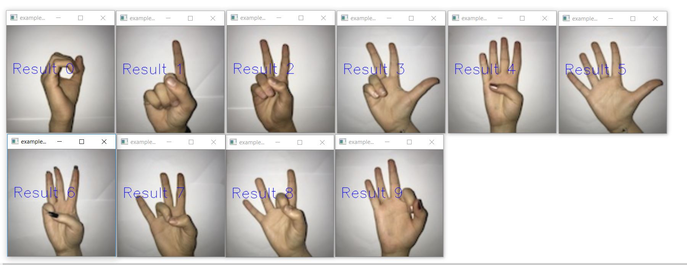
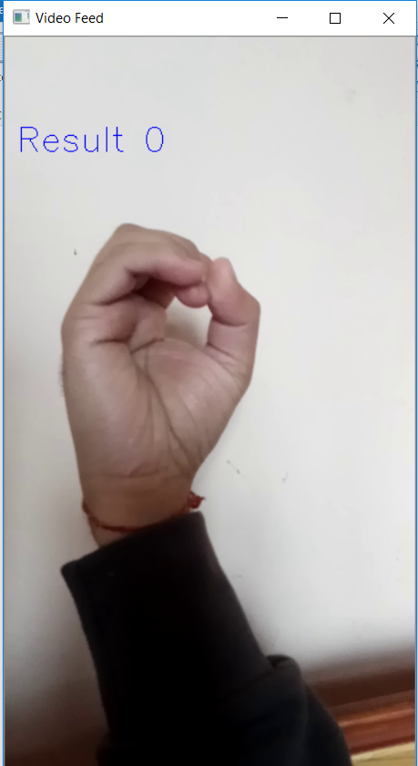
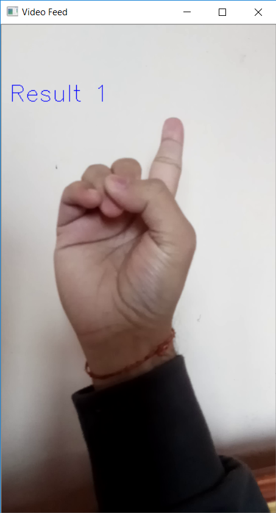
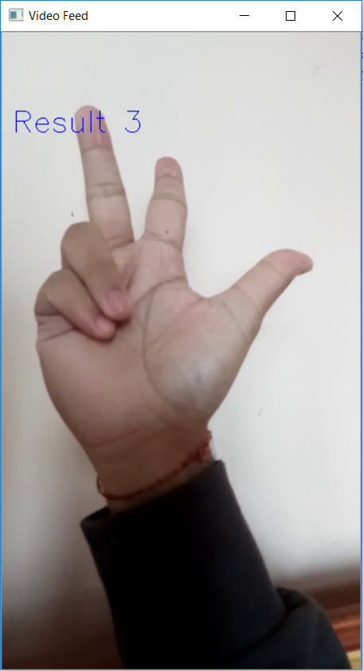
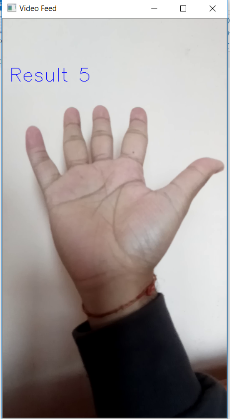
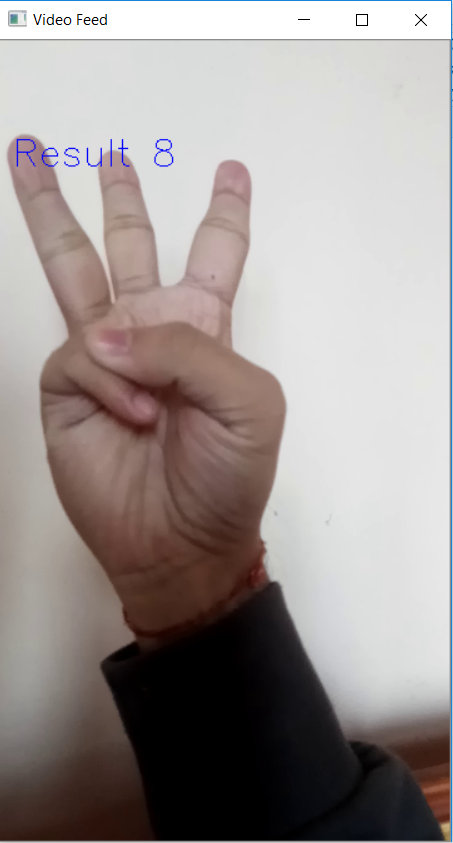

# Sign Digit Detection

Detect Digit Signs.

[Dataset Used](https://github.com/ardamavi/Sign-Language-Digits-Dataset)

Trained on GTX 1060 with Tensorflow 2.4.0, CUDA 11.0 & CUDNN 8.4 .

## Results From examples

## Results From camera

Invalid Output (Should be 6)

